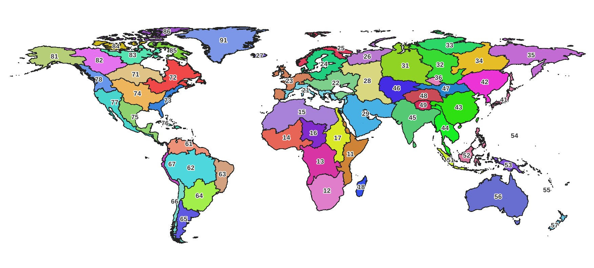

# Readme for delineator.py

This set of Python scripts lets you perform fast, accurate watershed delineation for any point on the Earth's land surface, using a hybrid of vector- and raster-based methods and the datasets MERIT-Hydro and MERIT-Basins.

Try the online demo at [https://mghydro.com/watersheds/](https://mghydro.com/watersheds/)

Sample data is included covering Iceland. To use this script to delineate watersheds for other locations, you will need to download datasets from MERIT-Hydro and MERIT-Basins. Instructions on how to get the data and run the script are provided below.

# Using these scripts

Download all of the files from this GitHub repository. If you're a GitHub user, you can fork the repository. You can also simply download all of the files here:
https://mghydro.com/watersheds/delineator.zip](https://mghydro.com/watersheds/delineator.zip)

These scripts were developed and tested with Python version 3.9. 

I recommend creating a Python virtual environment in which to run `delineator.py`. Here is a good [introduction to virtual environments](https://python.land/virtual-environments/virtualenv) -- why they are useful, and how to use them. You can create and activate the virtual environment, then install all the required packages with the following commands. 

Open the Terminal (Linux and Mac) or Command Prompt (Windows), `cd` to the directory where you saved delineator.py and its files, and enter these commands.

To create the virtual environment:
```
python -m venv venv
```

To activate the virtual environment:

```
# Windows cmd.exe
venv\Scripts\activate.bat

# Windows PowerShell
venv\Scripts\Activate.ps1

#Linux and MacOS venv activation
$ source venv/bin/activate
```

Next, install required packages:
```
$ pip install -r requirements.txt
```

After this, follow the instructions below for how to get the input data, configure the settings, and run `delineator.py`.

# Overview of how to use

The major steps are the following, with more detailed instructions below.

1. [Download basin-scale MERIT-Hydro raster data (mghydro.com)](#step1)
2. [Download MERIT-Basins vector data (Princeton U.)](#step2)
3. [Download simplified MERIT-Basins data (mghydro.com)](#step3)
4. [Create a CSV file with your desired watershed outlet points](#step4)
5. [Edit settings in `config.py`](#step5)
6. [Run `delineator.py` to delineate watersheds](#step6)
7. [Review output](#step7)
8. [Run again to fix mistakes (repeat steps 4 – 7)](#step8)

Before you begin downloading data in steps 1 and 2, determine which files you need based on your region of interest. The data files are organized into continental-scale river basins, or Pfafstetter Level 2 basins. There are 61 of these basins in total. Basins are identified by a 2-digit code, with values from 11 to 91. 



# Detailed Instructions

## <a name="step1">1. Download MERIT-Hydro raster data</a>

In order to delineate watersheds in the normal "high-precision mode," you will need two sets of MERIT-Hydro gridded (or raster) data for **flow accumulation** and **flow direction**. The authors of the MERIT-Hydro created 5-degree tiles, but this script needs larger data files that cover continental-scale river basins. Download these data at:

[https://mghydro.com/watersheds/rasters](https://mghydro.com/watersheds/rasters).

You will need to update `config.py` to tell the script where these data are located. Modify the variables:

- `MERIT_FDIR_DIR`
- `MERIT_ACCUM_DIR`


## 2. <a name="step2">Download MERIT-Basins vector data</a>

Download the shapefiles for unit catchments and rivers. Follow the instructions here:
<a href="https://www.reachhydro.org/home/params/merit-basins">https://www.reachhydro.org/home/params/merit-basins</a>

In the folder `pfaf_level_02` , download two sets of files:

1. unit catchment shapefiles: `cat_pfaf_##_MERIT_Hydro_v07_Basins_v01.shp`
2. river flowline shapefiles: `riv_pfaf_##_MERIT_Hydro_v07_Basins_v01.shp`

In these files, `##` is the Pfafstetter Level 2 basin code. See the figure above to determine which of the 61 different level 2 basins you need, depending on your region of interest. 

Unzip these files and save them to a folder on your hard drive. Then, in `config.py`, update the variable `HIGHRES_CATCHMENTS_DIR` and `RIVERS_DIR`.

## <a name="step3">3. Download simplified MERIT-Basins data</a>

In "low-resolution" mode, the script will look for a simplified version of the unit catchments shapefiles. Download these files from:

[https://mghydro.com/watersheds/share/catchments\_simplified.zip](https://mghydro.com/watersheds/share/catchments_simplified.zip)

Unzip and save these files to a folder on your computer. In `config.py`, update the variable `LOWRES_CATCHMENTS_DIR`.

## <a name="step4">4. Create a CSV file with your desired watershed outlet points</a>

The script reads information about your desired watershed outlet points from a plain-text comma-delimited (CSV) file. Edit this file carefully, as the script will not run if this file is not formatted correctly. 

The CSV file must contain a minimum of 3 fields or columns, and a maximum of 5 fields. There are two optional fields that are useful when reviewing the results.

- **id** - _required_: a unique identifier for your watershed or outlet point, an alphanumeric string. May be any length, but shorter is better. The script uses the id as the filename for output, so avoid using any forbidden characters. On Linux, do not use the forward slash /. On Windows, the list of forbidden characters is slightly longer (`\< \> : " / \ | ? \*`).

- **lat** - _required_: latitude in decimal degrees of the watershed outlet. Avoid using a whole number without a decimal in the first row. For example, use 23.0 instead of 23.

- **lng** - _required_: longitude in decimal degrees

- **name** - _optional_: a name for the  watershed outlet point. The text in this field should be surrounded by straight quotes. For example, "Elwha River at McDonald Bridge near Port Angeles, WA"

- **area** - _optional_: if you have an _a priori_ estimate of the watershed area, provide it here in square kilometers, km².

All latitude and longitude coordinates should be in unprojected decimal degrees (EPSG: 4326, [https://spatialreference.org/ref/epsg/wgs-84/](https://spatialreference.org/ref/epsg/wgs-84/)).

## <a name="step5">5. Update `config.py`</a>

Read through the options and set the variables. Detailed instructions below. 

## <a name="step6">6. Run `delineator.py` to delineate watersheds</a>

Once you have downloaded the datasets listed above, and updated `config.py`, you are ready to delineate watersheds. Run `delineate.py` from your favorite Python IDE or from the command line:

    >> python delineate.py

## <a name="step7">7. Review results</a>

The script can output your watersheds as shapefiles or GeoJSON files, which you can view in your favorite GIS software.

The script also can create web page to review your results on an interactive map. In `config.py`, set `MAKE_MAP = True`, and enter your desired file path in `MAP_FOLDER`. The script will create `.js` files for each watershed with the geodata in a format readable by the web browser.

To view your watersheds, open the file `_viewer.html` in a web browser and click on a watershed ID. The table is sortable and searchable. 

## <a name="step8">8. Run again to fix mistakes</a>

Automated watershed delineation often makes mistakes. The good news is that these errors can often be fixed by slightly moving the location of your watershed outlet.

Repeat steps 4 to 7 by creating a new CSV file, or modifying your existing file with revised coordinates. The script will automatically overwrite existing files.

# Configuration Notes

Here are some more details on the variables in the file `config.py`.

## Watershed Outlets CSV file

This GitHub repository contains example files to delineate several watersheds in Iceland. To delineate watersheds in other regions, follow the instructions above to download the input data files. The locations in `outlets_sample.csv` correspond to flow measurement gages in the [GRDC](https://bafg.de/GRDC) database. 

(I chose Iceland because the data files for this region are small. In addition, Iceland has some [astonishingly beautiful](https://guidetoiceland.is/nature-info/rivers-in-iceland) rivers!)

You can create your own CSV file and name it anything you like. In `config.py`, enter the file name in the variable `OUTLETS_CSV`. Your CSV file should have a header row with these fields written exactly like this:

`id, lat, lng, name, area`

It does not matter whether or not you include a space after each comma.

The first three fields (id, lat, lng) are required. The fields `name` and `area` are optional but are useful if you have them. 

## Low-resolution vs. high-resolution mode

If you are going to be creating large watersheds, say over 50,000 km², this script will be slow. This is a due to limitations in the loading data from shapefiles, and the processing speed with the Python libraries GeoPandas and pygeos. On my laptop, it took over 30 minutes to delineate the Amazon watershed (admittedly the largest watershed on earth). 

For large watersheds, it is usually better to use low-precision mode, which will run more quickly, but with a slight loss in precision, which is barely noticeable in large watersheds.

In config.py, if you set `LOW_RES_THRESHOLD = 50000`, then all watersheds with an area greater than 50,000 km² will automatically use low-resolution mode.

You may also turn off "high resolution" mode completely. In `config.py`, set `HIGH_RES = False`.

If you will _only_ use low-resolution mode, you do not have to download the high-resolution raster data described in Step 1 above.

In low-resolution mode, there are two differences. First, the program will look for shapefiles containing simplified unit catchment boundaries. Because the polygons have fewer vertices, processing them is faster.

To faster delineation of large watersheds, consider using the **online demo version** at [https://mghydro.com/watersheds](https://mghydro.com/watersheds)

The online version has two optimizations that make it run much faster. First, it loads the geodata from a PostgreSQL database, rather than reading shapefiles from disk. Second, it uses PostGIS rather than GeoPandas for processing the vector data.

## Search Distance
Sometimes, your watershed outlet point will not fall inside one of the MERIT-Hydro unit catchments. Your point could be just offshore in the ocean or an estuary, or it may happen to fall into one of the many small gaps and slivers in the source dataset. 

The variable `SEARCH_DIST` controls how far the script how far away from the pointshould we look for the nearest catchment (in decimal degrees). Setting `SEARCH_DIST = 0` means that the point MUST fall inside a unit catchment. I recommend setting it to at least 0.005 for good results. 

## Filling holes in watershed polygons

In `config.py`, set `FILL = True` to fill in small gaps "donut holes" in the watershed. 

Oftentimes, watersheds created by computer will contain internal gaps in the watershed polygon. How to handle these is somewhat of an outstanding question in hydrology, but my view is that most of these donut holes are unwanted.

However, there are exceptions. For example, look up maps of the Rio Grande watershed (or try creating it yourself, with outlet coordinates at 26.05, -97.2).

Many maps of the Rio Grande watershed show it with a big hole in the middle, between the Rio Grande in the west and the Pecos River in the east, running north-south for 350 miles from Texas to New Mexico. Inside this area, there are several alkaline lakes or "playas," where water flows in and evaporates rather than flowing out to the ocean.

This script creates watersheds by merging MERIT-Basins unit catchments. These data have lots of little gaps and slivers, and so the resulting watersheds often have hundreds of little holes. I recommend have the program to fill these in for you. To do this, in `config.py`, set `FILL = True`, and enter a non-zero value for `FILL_THRESHOLD`.

### Fill threshold
The script allows you to fill in small holes and keep big ones. If you have set `FILL` to True, the variable `FILL_THRESHOLD` controls what size holes get filled in. 

The size threshold is roughly the number of pixels on a 3 arcsecond grid. In the source data, a pixels is 0.000833° square. This is about 90m x 90m near the equator, or about 0.0081 km². The pixels get smaller in terms of surface areaas you move north or southaway from the equator.

Setting `FILL_THRESHOLD = 10` will fill in any donut holes with a size of 10 pixels or less # and leave larger holes in place.

Setting `FILL_THRESHOLD = 0` will fill *all* donut holes. 

## Simplify Output
The output from the script may contain more detail than you need. To remove some vertices from the watershed boundary,
 set `SIMPLIFY = True`. 
 
 You will also need to set `SIMPLIFY_TOLERANCE` to a value in decimal degrees. This corresponds to the distance parameter in the [Douglas-Peucker algorithm](https://cartography-playground.gitlab.io/playgrounds/douglas-peucker-algorithm/). 
 
Note that the vector polygons in the input data have been digitized from pixels with an edge length of 0.000833°. Setting `SIMPLIFY_TOLERANCE` to about half of this size or
higher will remove the jagged "staircase" appearance of the watershed boundary.

You might also try setting `SIMPLIFY = False`, and simplify the watersheds with a different method. I highly recommend [mapshaper.org](https://mapshaper.org).

## Match Area

In `config.py`, if you set `MATCH_AREAS = True`, the script will not snap your outlet point to the closest river reach. Rather, it will search the neighborhood around the outlet point until it finds a river reach whose reported upstream area is a close match to your estimated watershed area. 

This feature might be useful when you are looking for large watersheds, but the script is outputting small watersheds. Sometimes, the script will find the watershed for a small tributary stream instead of the large river you are looking for. 

**Note: this feature is experimental, and can produce weird and unexpected results.** It does not work well for small watersheds, say below 1,000 km².

Also, you can only use this feature where you have provided an estimated upstream watershed area in your outlets CSV file. 

If you have set `MATCH_AREAS = True`, you also need to provide a value for `AREA_MATCHING_THRESHOLD`. This value is a percentage. For example, enter 0.25 to specify that the upstream area of a river reach should be within 25% of your estimated area to be considered a match. 


