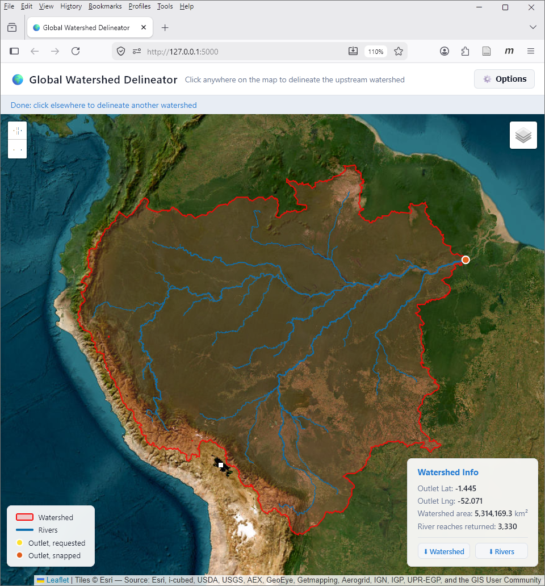
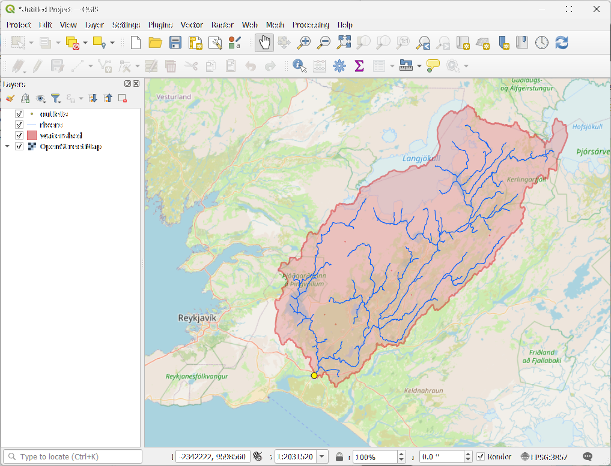
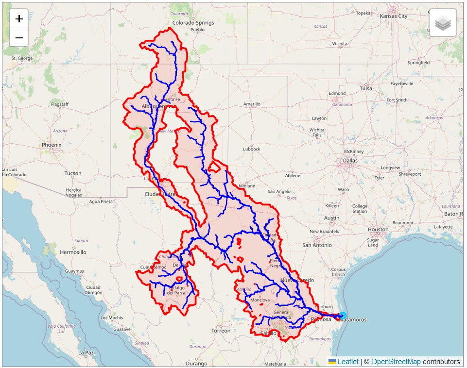
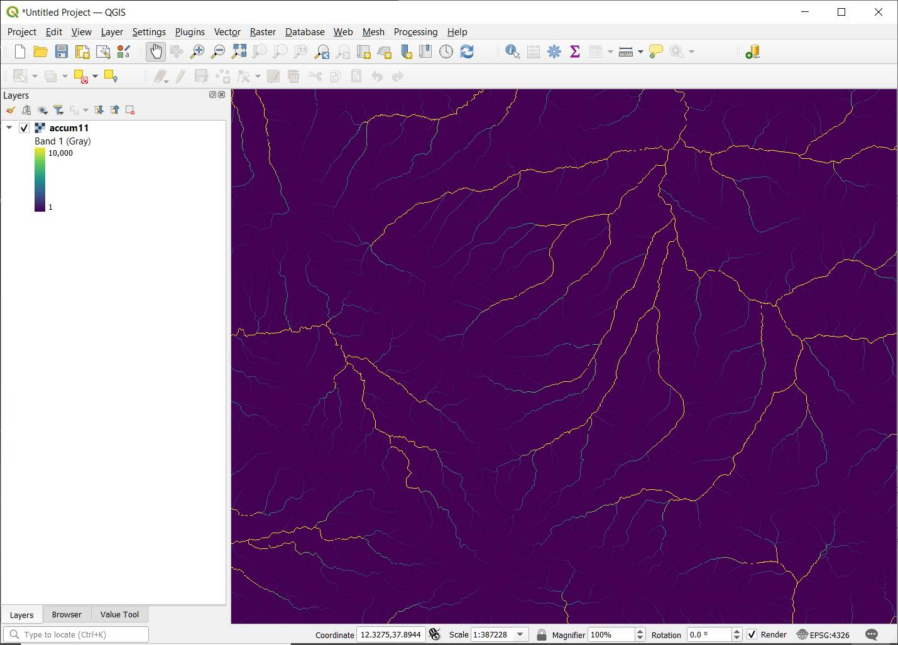
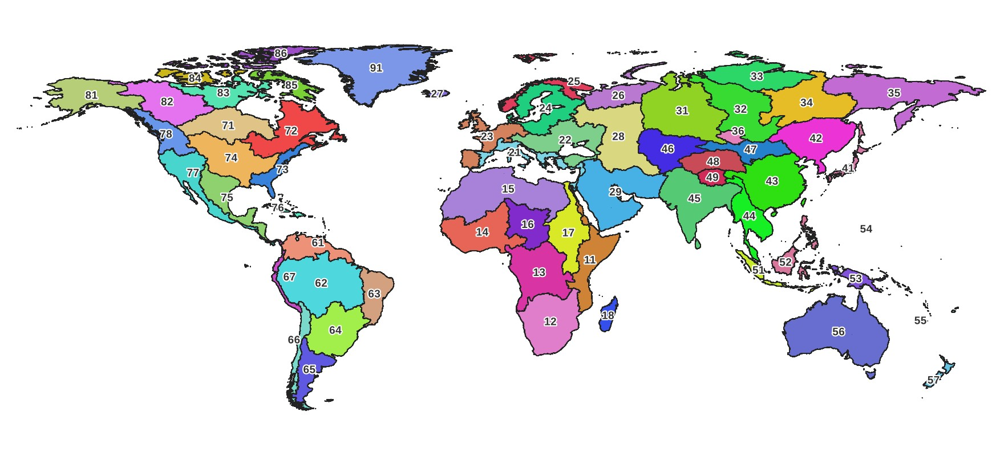
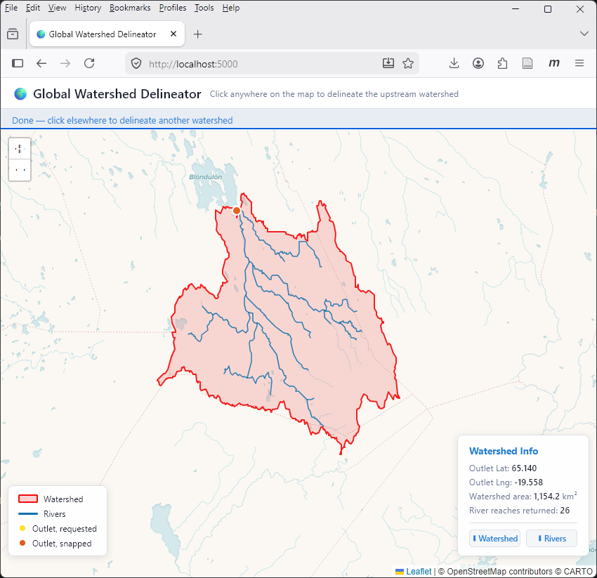
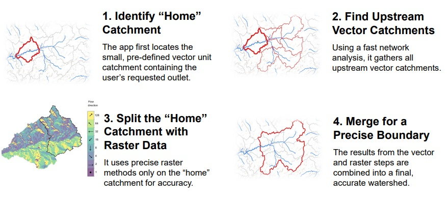
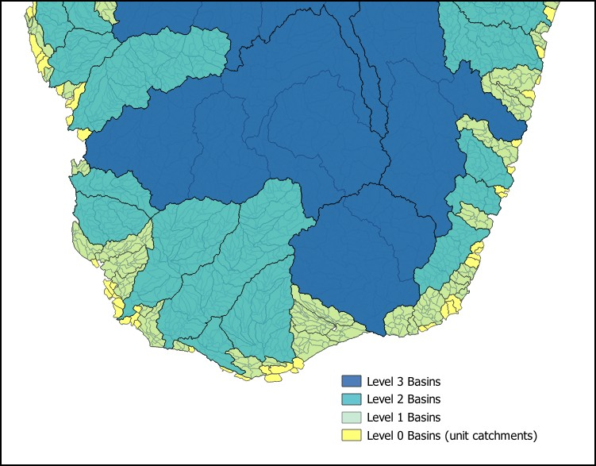

# delineator: Global Watershed Delineation with Python

[](https://pypi.org/project/delineator/)
[](https://github.com/mheberger/delineator/releases)
[](https://github.com/mheberger/delineator/blob/main/LICENSE.txt)
[](https://zenodo.org/badge/latestdoi/564865701)

A Python package for fast, accurate watershed delineation for any point 
on Earth's land surface, using a hybrid of vector- and raster-based methods with
data from 
[MERIT-Hydro](https://global-hydrodynamics.github.io/MERIT_Hydro/) 
and [MERIT-Basins](https://www.reachhydro.org/home/params/merit-basins). Features include:

- Near-global coverage (excludes Greenland, Antarctica, and some small islands).
- Returns watershed, river network, and outlet points.
- Ouput to multiple formats: GeoPackage, GeoJSON, Shapefile, KML, parquet.
- Includes a local web app for interactive exploration.
- Bundled sample data for Iceland; other regions download automatically on first use.



## Contents

- [Installation](#installation)
- [Quick Start](#quick-start)
- [Dependencies and computational requirements](#dependencies-and-computational-requirements)
- [Command line reference](#command-line-reference)
- [Configuration reference](#configuration-reference)
- [Data files](#data-files)
- [Always review your results!](#always-review-your-results)
- [Interactive local web app](#interactive-local-web-app)
- [Algorithm](#algorithm)
- [Citation](#citation)
- [Contributing](#contributing)


## Installation

Requires Python ≥ 3.10. Python 3.11+ is recommended for speed. It is highly
recommended to install in a fresh virtual environment to avoid dependency 
conflicts.

**macOS/Linux:**

```bash
python3 -m venv venv
source venv/bin/activate
pip install delineator
```

**Windows Command Prompt:**

```cmd
python -m venv venv
venv\Scripts\activate
pip install delineator
```

Note: for some Windows setups, you may need to use `py` instead of `python`.

**Windows Powershell:**

```powershell
python -m venv venv
.\venv\Scripts\Activate.ps1
pip install delineator
```

You may also hit an execution policy error the first time:

```
venv\Scripts\Activate.ps1 cannot be loaded because running scripts is disabled on this system.
```

Fix with (one-time per session):

```powershell
powershellSet-ExecutionPolicy -ExecutionPolicy RemoteSigned -Scope CurrentUser
```


## Quick start

The bundled Iceland data lets you run immediately after installation; no separate 
download required.

### Command line usage

```bash
delineate --point 63.938 -21.004
```

This creates the watershed for the Ölfusá River at Route 1 in Iceland.
Output is written to `./output/watershed.gpkg` in your current directory, 
with layers for the watershed boundary, river network, and outlet points
(requested and snapped to the river centerline).

Here is an example of the output displayed in QGIS:



You can enter coordinates for watershed outlets almost anywhere in the 
world, and the package will attempt to download the necessary data files. 
See the section **Data Files** below for details. 

### Python script usage

Alternatively, you can use the `delineate()` function in your 
own Python scripts or notebooks.

```python
from delineator import delineate, write_outputs

# The delineate function returns three GeoDataFrames
# Note the order of latitude, longitude!
watershed_gdf, rivers_gdf, outlets_gdf = delineate(63.938, -21.004)

# Do whatever you wish with the resulting GeoDataFrames.
# This utility function will write them to disk in one line. 
write_outputs(watershed_gdf, rivers_gdf, outlets_gdf, id="olfusa")
```


## Dependencies and computational requirements

### Software dependencies

`delineator` requires Python ≥ 3.10. All dependencies are open-source Python
packages installed automatically from [PyPI](https://pypi.org/) by `pip`.

**Supported operating systems.** The package is developed and tested on
Windows, macOS, and Linux, and any of these is a safe choice. This is not a
limitation of `delineator` itself, which is pure Python, but of its
geospatial dependencies: the underlying C libraries (GDAL, GEOS, PROJ) reach
Python through packages such as `rasterio`, `shapely`, `pyproj`, and
GeoPandas's I/O engine, and the maintainers of those packages publish
pre-built binary wheels on PyPI only for these three operating systems (on
common CPU architectures: 64-bit x86 for all three, plus Apple Silicon on
macOS and ARM64 on Linux). On those platforms `pip install delineator`
pulls in everything with no compiler or separate GIS software needed.

Other Unix-like systems, including FreeBSD, are not covered by PyPI wheels.
`delineator` has no platform-specific code, so it can in principle run
anywhere the geospatial stack is available, but you would have to obtain that
stack another way — for example the FreeBSD Ports collection packages GDAL,
GEOS, PROJ, and their Python bindings — rather than through `pip`. This path
is untested and unsupported here.

Dependencies:

| Package                                                  | Minimum version | Role in `delineator`                                              |
|----------------------------------------------------------|-----------------|-------------------------------------------------------------------|
| [click](https://click.palletsprojects.com/)              | 8.2             | Command-line interface                                            |
| [Flask](https://flask.palletsprojects.com/)              | 3.1             | Local web app (`delineator_serve`)                                |
| [GeoPandas](https://geopandas.org/)                      | 1.0             | Vector geodata handling and output to file formats                |
| [NumPy](https://numpy.org/)                              | 1.24            | Array operations on raster data                                   |
| [pandas](https://pandas.pydata.org/)                     | 2.0             | Tabular data (batch CSV input, attribute tables)                  |
| [platformdirs](https://platformdirs.readthedocs.io/)     | 3.0             | Locating the per-user data directory on each OS                   |
| [Pooch](https://www.fatiando.org/pooch/)                 | 1.7             | Downloading data files with SHA-256 verification                  |
| [pyproj](https://pyproj4.github.io/pyproj/)              | 3.6             | Geodesic (ellipsoidal) area calculations                          |
| [pysheds](https://github.com/mdbartos/pysheds)           | 0.5             | Raster delineation of the outlet's unit catchment                 |
| [rasterio](https://rasterio.readthedocs.io/)             | 1.3             | Reading flow-direction and flow-accumulation rasters              |
| [Requests](https://requests.readthedocs.io/)             | 2.28            | Checking remote file sizes before download                        |
| [Shapely](https://shapely.readthedocs.io/)               | 2.0             | Geometry operations (dissolve, simplify, etc.)                    |
| [tqdm](https://tqdm.github.io/)                          | > 4.67          | Download progress bars                                            |

Vector data is stored in SQLite databases and read with Python's built-in
`sqlite3` module; no database server or SpatiaLite extension is required at
runtime.

### Computational requirements

The package is designed to run on an ordinary desktop or laptop computer.
It runs in a single Python process on a single CPU core, with no GPU,
parallel-computing, or internet-server requirements.

- **Memory:** Delineation avoids loading whole datasets into memory: rasters
  are read only in a window around the outlet's unit catchment, and vector
  data is fetched with indexed SQL queries. Delineating the bundled example
  watershed in Iceland (5,754 km²) has a measured peak memory footprint of
  about 310 MB, including the Python interpreter and all imported libraries.
  Any machine with 8 GB of RAM is more than sufficient, even for
  continental-scale watersheds like the Amazon.
- **Speed:** On a circa-2020 laptop (Intel Core i7-10610U @ 1.80 GHz, 32 GB
  RAM), watersheds of roughly 40,000–86,000 km² take about 0.5–1.5 seconds
  each (median 0.8 s; see the `benchmarking` folder in this repository).
  Delineating the largest watersheds on Earth, such as the Amazon at its 
  mouth, takes under 20 seconds.
- **Disk space:** The installed package includes about 135 MB of bundled
  data for Iceland. Additional regions download on demand,
  ranging from about 26 MB to 3.5 GB per megabasin. The complete
  global dataset is about 80 GB, but you only need the megabasins that
  contain your outlet points.
- **Network:** An internet connection is needed only to install the package
  and to download data files on first use of each region. After that,
  everything runs offline.


### Command line reference

```bash
# Single point
delineate --point 63.938 -21.004

# Exclude rivers and outlet points from the output
delineate --point 63.938 -21.004 --rivers false --outlets false

# Output different file formats
delineate --point 63.938 -21.004 --output-format geojson
delineate --point 63.938 -21.004 --output-format shp
delineate --point 63.938 -21.004 --output-format kml
delineate --point 63.938 -21.004 --output-format parquet

# Batch delineation of multiple outlet points in a CSV file
delineate --csv outlets.csv

# Custom output directory
delineate --csv outlets.csv --output-dir /path/to/output/

# List all the command line options
delineate --help
```

For batch delineation, the CSV file must contain at minimum `id`, `lat`, and `lon` columns.
Other columns are OK but will be ignored by the script. Example CSV file:

```
id,lat,lon,name
6401070,64.71072,-21.60337,Nordhura River at Stekkur
6401080,64.69229,-21.41046,Hvita River at Kljafoss
6401090,63.93796,-21.00666,Olfusa River at Selfoss
```

### Output files

When `--output-format gpkg` (the default), all layers are written to a single file 
(`watershed_<id>.gpkg`) with three layers: `watershed`, `rivers`, and `outlets`. 

For other formats like `shp`, each layer is written to a separate file, for example 
`rivers.shp`, `outlets.shp`, and `watershed.shp`.

### Environment variables

Instead of passing options to the command line, you can set environment variables. 
There are three environment variables:

- `DELINEATOR_DATA_DIR`: directory where input data files are saved
- `DELINEATOR_OUTPUT_DIR`: directory where output files will be saved
- `DELINEATOR_AUTO_DOWNLOAD`: whether to automatically download data files as 
  they are needed

Environment variables work with the command-line interface or with 
the Python functions (`delineate()`, `downloader()`). Note that 
command line arguments will override environment variables, as will 
 the `DelineatorConfig` object passed to `delineate()`.

Set the three available environment variables as follows:

Mac/Linux:

```bash
export DELINEATOR_DATA_DIR=/mnt/data/delineator
export DELINEATOR_OUTPUT_DIR =/home/user/documents/watersheds
export DELINEATOR_AUTO_DOWNLOAD=false
delineator --csv outlets.csv
```

Windows CMD:

```cmd
set DELINEATOR_DATA_DIR=D:\Data\delineator
set DELINEATOR_OUTPUT_DIR=C:\Users\user\Documents\watersheds
set DELINEATOR_AUTO_DOWNLOAD=false
delineator --csv outlets.csv
```

Windows Powershell:
```powershell
$env:DELINEATOR_DATA_DIR = "D:\Data\delineator"
$env:DELINEATOR_OUTPUT_DIR = "C:\Users\user\Documents\watersheds"
$env:DELINEATOR_AUTO_DOWNLOAD = "false"
delineator --csv outlets.csv
```

## Configuration reference

When using the Python function `delineate()`, options are passed to the main
delineate function via a `DelineatorConfig` object:

```python
from delineator import delineate, DelineatorConfig

config = DelineatorConfig(
    high_res=True,
    rivers=True,
    fill=True,
    output_format="gpkg",
    output_dir="/path/to/output",
)

watershed_gdf, rivers_gdf, outlets_gdf = delineate(63.938, -21.004, config)

# Config objects are mutable - update and reuse
config.rivers = False
config.outlets = False
config.output_format = "geojson"
watershed_gdf, _, _ = delineate(63.938, -21.59, config)
```

All options with their defaults:

| Option                 | Default        | Description                                                                                                                                                                                                                     |
|------------------------|----------------|---------------------------------------------------------------------------------------------------------------------------------------------------------------------------------------------------------------------------------|
| `auto_download`        | `True`         | Automatically download missing data files on first use.                                                                                                                                                                         |
| `cache`                | `False`        | Cache the upstream-catchment queries and polygon dissolve in memory, keyed on the outlet's unit catchment. Speeds up repeated delineations with nearby outlets. See [Caching](#caching) below.                                  |
| `calc_area`            | `True`         | Calculate the watershed area in km² and add it to the output attribute table.                                                                                                                                                   |
| `clean`                | `True`         | Apply a small buffer/unbuffer to repair seam artifacts in the watershed polygon.                                                                                                                                                |
| `data_dir`             | system default | Directory where data files are stored and downloaded. Overrides the platform default location.                                                                                                                                  |
| `fill`                 | `True`         | Fill small interior "donut holes" caused by topological gaps in the MERIT-Hydro data.                                                                                                                                           |
| `fill_area_max`        | `1.0`          | Maximum hole size to fill, in km². Only used when `fill=True`. Larger holes are preserved (e.g. genuine endorheic basins). **Set to `0` to fill all holes.**                                                                    |
| `high_res`             | `True`         | Refine the watershed boundary at the outlet using raster methods. More accurate but slower. Set `False` to skip (the watershed will include some area downstream of the outlet).                                                |
| `num_stream_orders`    | `4`            | Number of stream orders to include in the river network output. Higher values give a more detailed network; set ≥ 9 for all available reaches. Only used when `rivers=True`.                                                    |
| `outlets`              | `True`         | Include the requested and snapped outlet points in the output.                                                                                                                                                                  |
| `output_dir`           | `./output/`    | Directory for output files.                                                                                                                                                                                                     |
| `output_format`        | `gpkg`         | Output format: `gpkg`, `geojson`, `shp`, `kml`, or any other GeoPandas-supported driver.                                                                                                                                        |
| `rivers`               | `True`         | Include the upstream river network in the output.                                                                                                                                                                               |
| `round_coordinates`    | `True`         | Round output vertex coordinates to 6 decimal places (~10 cm near the equator). Saves disk space with minimal loss of precision.                                                                                                 |
| `search_dist`          | `5.0`          | Distance in km to search for a catchment containing the outlet, or to snap the outlet to a river centerline. Accepts values from 0 to 50 km.                                                                                    |
| `simplify`             | `False`        | Simplify output geometry using the Douglas-Peucker algorithm. Reduces file size and removes staircase artifacts from raster-origin boundaries.                                                                                  |
| `simplify_tolerance`   | `0.10`         | Douglas-Peucker tolerance in km: the maximum distance a vertex may move from its original position. Only used when `simplify=True`.                                                                                             |
| `smooth`               | `False`        | Smooth the output geometries for a more natural appearance: rivers with Catmull-Rom splines, the watershed boundary with Chaikin corner cutting. Best used together with `simplify=True`.                                       |
| `snapping`             | `True`         | Snap the provided outlet to a stream on the raster grid. Most users should keep this enabled; provided as an alternative for testing or a custom snapping routine.                                                              |
| `stream_threshold_km2` | `25.0`         | Minimum upstream drainage area (km²) for a grid cell to count as a stream when snapping the outlet. Applies to watersheds spanning multiple unit catchments; setting it too low causes incorrect results and topology problems. |
| `verbose`              | `False`        | Print progress messages to the console.                                                                                                                                                                                         |


### Notes on select options


#### Caching

For large watersheds, most of the delineation time is spent finding the
upstream unit catchments and dissolving their polygons into a single boundary.
That result is identical for every outlet that falls in the same unit
catchment, so with `cache=True` it is computed once and reused. This makes
repeated delineations around the same location much faster — for example,
outlets near the mouth of the Rio Negro take about 8 seconds on the first call
and about 2.5 seconds afterward (the raster refinement of the area around the
outlet still runs on every call). Caching helps most for interactive use, where users
often click several points along the same river reach — the local web app
enables it by default. It will not speed up batch runs where every outlet lands in a different
unit catchment.

The cache is held in memory, holds up to 64 watersheds, and can be emptied
with `delineator.clear_cache()`. It assumes the data files do not change while
your program runs; if you point the script at a different data directory
mid-session, call `clear_cache()`.


#### Filling holes

Setting `fill=True` removes small interior gaps or "donut holes" in the watershed polygon. These 
arise from slivers between unit catchments in the source data and are usually unwanted. 
The `fill_area_max` parameter (in km²) controls which holes are filled; 
larger holes representing genuine endorheic (internally draining) basins can 
be preserved by setting a threshold.

For example, the Rio Grande watershed contains a large endorheic basin between 
the main stem and the Pecos River that should probably *not* be filled, at least
for studies of surface drainage:




#### Search distance

If the outlet point falls just offshore, in an estuary, or in a gap between unit
 catchments, `search_dist` controls how far (in km) the script 
 searches for the nearest catchment. A larger value (up to the 50 km maximum) may help 
 for coastal outlets.


#### Simplify

The watershed boundary inherits the staircase pattern of the underlying raster 
grid (pixel edge length ≈ 0.000833°). Setting `simplify=True` with 
`simplify_tolerance ≈ 0.05` km or higher removes this artifact and reduces file size.
The `simplify_tolerance` parameter is equivalent to the threshold for 
[Douglas-Peucker simplification](https://en.wikipedia.org/wiki/Ramer%E2%80%93Douglas%E2%80%93Peucker_algorithm).


#### Smoothing

Setting `smooth=True` rounds off the angular joints that remain after 
simplification, for output that looks more like a hand-drawn map: river 
polylines are smoothed with 
[centripetal Catmull-Rom splines](https://en.wikipedia.org/wiki/Centripetal_Catmull%E2%80%93Rom_spline) 
(the curve still passes through every input vertex), and the watershed 
boundary with 
[Chaikin corner cutting](https://en.wikipedia.org/wiki/Chaikin%27s_algorithm). 
Smoothing is applied *after* simplification and works best with 
`simplify=True`: without it, the smoothed line faithfully traces the raster 
staircase instead of removing it. Smoothing is cosmetic; it adds vertices 
and slightly cuts polygon corners, so leave it off if you need the output to 
match the source data exactly.


#### Snapping

The process of "snapping" the outlet point to a river centerline is where 
watershed delineation becomes both an art and a science. The `stream_threshold_km2` 
parameter sets the minimum upstream drainage area 
(in km²) a grid cell must have to count as a stream, i.e., a valid target for 
the outlet to snap to. Setting it too low can snap the outlet onto a minor 
channel and may not give the desired result. Setting it too high will snap the 
outlet to a large river, and you may not be able to find small watersheds.




## Data files

The `delineator` package comes bundled with data for Iceland. Beyond this, 
you will need data files for other regions. 
The globe is divided into 59 **megabasins** (integer IDs 11–86, data for 
Greenland, megabasin 91, has been omitted):



Each megabasin requires four data files (vector catchments, vector rivers, 
flow-direction raster, accumulation raster). These download automatically 
on first use and are saved in your system's default data directory:

- **Windows:** `C:\Users\<username>\AppData\Local\delineator`
- **Linux:** `~/.local/share/delineator`
- **macOS:** `~/Library/Application Support/delineator`

To pre-download data for a region:
```bash
delineator_download --basin 62    # e.g. basin 62 = Amazon
delineator_dir                    # show the data directory location
```

You can also download these datasets manually by visiting:
[https://mghydro.com/watersheds/data/](https://mghydro.com/watersheds/data/).

Some regional datasets are up to 3 GB, so pre-downloading is recommended for 
large basins.

Override the default data directory with an environment variable:
```bash
# macOS/Linux
export DELINEATOR_DATADIR=~/gis/delineator_data

# Windows
set DELINEATOR_DATADIR=D:\GIS\delineator_data
```


## Always review your results!

**No automated watershed delineation software can replace human judgment. Always visually inspect every watershed you create with this package. There is no guarantee the output is correct.**

Errors are common and often easy to miss without inspection. The good news is 
that many mistakes can be fixed by slightly adjusting the outlet coordinates 
and re-running. An experienced analyst can usually identify and resolve problems 
quickly, especially with an interactive map display.

### Where delineation is most likely to fail

Certain landscapes are inherently challenging for any automated tool:

- **Flat terrain** — where flow direction is ambiguous. Examples: Florida, 
  the Netherlands, the Ganges-Brahmaputra Delta.
- **Arid and semi-arid areas** — where channels are sparse or ephemeral. 
  Examples: North Africa, Central China, the American Southwest.
- **Frozen environments** — glaciers, tundra, and permafrost. Examples: Iceland,
   Greenland, northern Canada, northern Russia.
- **Karst and highly permeable terrain** — where surface drainage boundaries are
   poorly defined because water moves through the subsurface. Examples: the 
   Yucatán Peninsula, parts of the Deschutes basin in Oregon, the Karst Plateau 
   along the Italy–Slovenia border.
- **Urban areas** — where impervious surfaces, curbs, storm sewers, and drains 
  alter or override natural flow paths.
- **Heavily engineered basins** — irrigation canals, inter-basin transfers, and 
pipelines can reroute water in ways that no terrain-based algorithm can detect.

### The most common error: incorrect pour point snapping

Even in well-behaved terrain, the most frequent source of error is pour point 
snapping, where the outlet is snapped to the wrong river reach, often a nearby 
tributary. This produces a watershed on a completely different branch of the 
river network. Such errors are not correlated with watershed size or geography 
and can be subtle if you are not looking carefully.

If the result looks wrong, try nudging the outlet coordinates toward the river 
centerline and re-running. The interactive map is useful for this kind of 
iterative review.

### Areas with no data

MERIT-Hydro does not cover Antarctica nor certain islands 
(e.g., Hawaii, the Azores). Delineation will fail silently for outlet points in 
these areas.


## Interactive local web app

New! Added in version 2.1.1. Spin up a local web-based point-and-click 
watershed delineation service similar to [Global Watersheds](https://mghydro.com/watersheds).

After installing the `delineator` package, run the following command:

```bash
delineator_serve
```
Open your web browser and visit [http://localhost:5000](http://localhost:5000).

The web app enables the [`cache`](#caching) option by default, so repeated 
clicks along the same river are much faster than the first.

If you want to save the geodata, click the little buttons at the bottom right 
to save the geodata to a file as GeoJSON. 




## Algorithm

The `delineator` combines three techniques to achieve speed and low memory use
compared to traditional raster watershed delineation methods:

1. **Hybrid raster/vector approach**: vector unit catchments handle the bulk of 
  the upstream area; raster methods refine only the home catchment 
  around the outlet.
2. **Hierarchical Spatial Aggregation**: pre-computed nested catchments at five 
  size levels (L0–L4) minimize the number of polygons that must be dissolved at 
  runtime.
3. **SQLite-backed geodata**: vector data is stored in relational SQLite 
  databases with spatial indexes, enabling fast SQL lookups rather than loading 
  entire datasets into memory.



The nested catchments at the southern end of Madagascar illustrate the 
aggregation levels:



For a more detailed description, see the manuscript: [Fast, accurate watershed delineation 
with a hybrid of raster and vector methods]
(https://mghydro.com/pages/Heberger_delineation_2025.pdf).


## Citation

If you use `delineator` in your research, please cite the project 
homepage, this GitHub repository. Here's a BibTeX entry:

```bibtex
@software{delineator,
  author    = {Matthew Heberger},
  title     = {delineator: Global Watershed Delineation with Python},
  year      = {2026},
  publisher = {GitHub},
  version   = {2.1},
  url       = {https://github.com/mheberger/delineator}
}
```

## Contributing

This project is open source and welcomes contributions. If you have comments 
or suggestions, please open an issue or drop the author an email.
