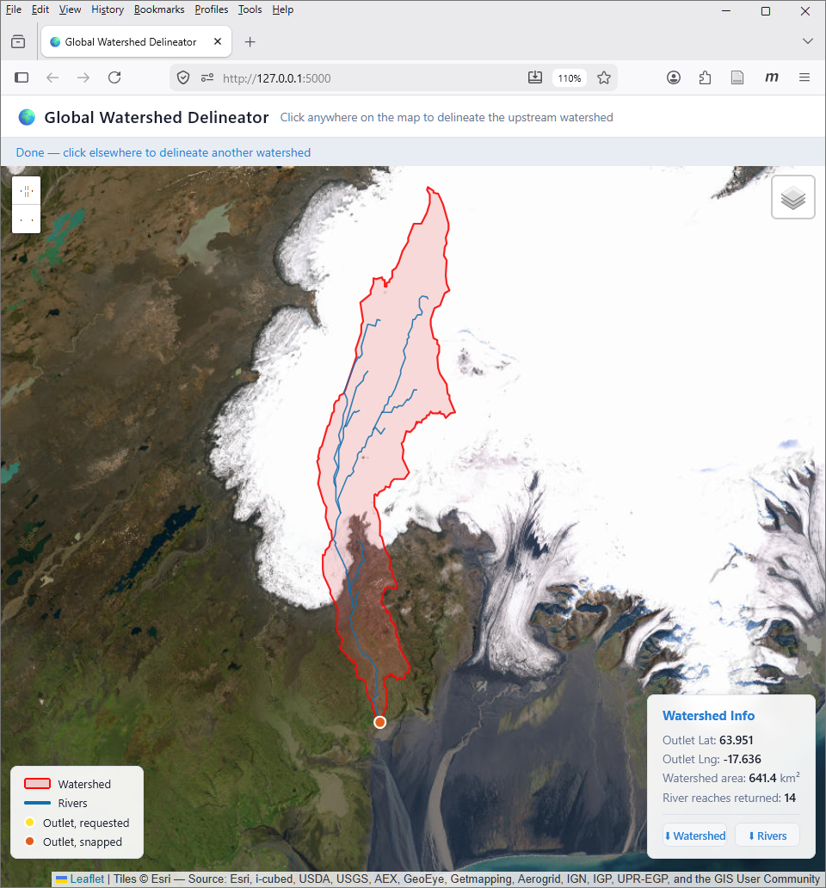

# Experiment 1 - Validate watershed boundaries created with `delineator`

Matthew Heberger
June 2026

In this experiment, I checked the correctness of the watershed
boundaries created with my Python package `delineator`. 

Watershed delienation with a flow-direction raster is deterministic, so 
any software package should give the same result when it is using the 
same input data, or flow-direction raster. In this experiment, we check whether 
`delineator` produces the same results as other software packages using the same 
MERIT-Hydro raster data. I delineated watersheds with:

 - delineator v2.2.0 
 - TauDEM v5, https://hydrology.usu.edu/taudem/taudem5/
 - pysheds v0.4, https://github.com/pysheds/pysheds 

For this experiment, I used a set of 20 outlets in megabasin 27, covering 
Iceland, in the file `outlets.csv`. The outlet points are for gages in the
catalog of the Global Runoff Data Center, or [GRDC](https://grdc.bafg.de/).
Here are the first few rows of the outlets table:


| id | lat | lng | name | area_grdc |
|--- | --- |---  | ---  | ------    |
| 6401070 | 64.71072 | -21.6034 | Nordhura River at Stekkur | 507 |
| 6401080 | 64.69229 | -21.4105 | Hvita River at Kljafoss | 1574 |
| 6401090 | 63.93796 | -21.0067 | Olfusa River at Selfoss | 5662 |
| 6401111 | 64.1601  | -20.5591 | Bruara River at Dynjandi | 640 |


## Expt 1a

The first time I ran this, I let each software package do the whole delineation
procedure, *including pour point snapping*. I saved the results in two formats:

- GeoTiff
- GeoJSON

For this experiment, I used a single Python script to perform delineation with 
each software package:

- `run_delineator.py`
- `run_pysheds.py`
- `run_taudem.py`

I compared the results visually in QGIS, and used Python scripts to calculate
the Intersection over Union (IoU), or Coefficient of Areal Correspondence (CAC).

- I use IoU when comparing rasters, as the formula computes the number of *pixels*
that overlap and intersect. This is in the script `compare_masks.py`.

- For the vectorized GeoJSON layers, I use the CAC. I first projected the 
results from the geographic coordinate system (CRS 4326) to a projected coordinate
system for Iceland (EPSG:3057). This calculation is in the script 
`compare_polygons.py`.

The results of this experiment were interesting and not exactly what I expected.
For delineator to give the same results as pysheds, it needs to have the 
configuration option `fill = False`.

Delineator and pysheds gave identical results for all 20 outlets, with IoU = 1.0.
The watersheds from TauDEM were slightly different however. The differences are
always in the area around the outlet, with the upland boundary the same. 

For 13 out of 20 watersheds, the watersheds created by TauDEM and delineator
are identical (IoU = 1.0). The IoUs are summarized in this little dotplot:

```
0.985000 | *
...      |
...      |
0.999760 | *
0.999950 | *
0.999980 | **
1.000000 | ***************
```
There is one watershed where there is a slightly larger difference, IoU = 0.985, 
and for 6 of the 20 outlets, the watersheds have minuscule differences, with IoU > 0.9997. 

The pour point snapping algorithm is slightly different for each software, so there are minor 
differences in the watershed around the outlet. These differences are usually 
3 - 10 pixels (for watersheds containing thousands of pixels). TauDEM's 
`MoveOutletstoStreams` routine uses the flow direction raster to trace downstream
starting at the requested point until it encounters a stream. In contrast, the 
snapping algorithm used with `pysheds` and adopted by me for `delineator` simply
searches the area around the reqested outlet for the nearest stream. 

There is one watershed where there is a substantial difference in the watersheds
created by TauDEM and pysheds or delineator (IoU = 0.985) . At gage 6401070, 
the Nordhura River at Stekkur (coordinates 64.71072, -21.60337), the TauDEM 
watershed is larger. TauDEM snapped the pour point one pixel away from the 
pysheds/delineator pour point. As a result of its slightly different placement
on the flow direction grid, it picked up the area drained by a small unnamed
creek near the gage. The only way to know which one is more correct is to 
consult with an Icelandic hydrographer with knowledge of this gage. However, 
this serves to show the importance of the pour point snapping routine. 


Experiment 1(a) failed to demonstrate that each software package will 
produce the exact same result. The problem was that they were not always starting
from the same outlet point. Therefore, I repeated the experiment with a 
modification to remove the influence of the pour point snapping
routine.

**Area Issue with one watershed**: For 19 of the 20 watersheds, the area of 
the delineated watershed was a close match to the area reported for the 
gage by GRDC, gage 6401500, Djupa River at Djupa Bru (coordinates 63.9509, -17.63609). 
The reported area was 226 km², while delineated watersheds with all 3 software 
packages hae an area of 641 km², a 65% percent difference. I believe that the 
reason for this difference is that the automated delineation is including surface
area from a glacier in the river's headwaters. A human hydrographer probably would
not include flow paths on or under a glacier in a watershed. 




## Expt 1b

For this experiment, we provide the snapped pour point to each package,
and we are isolating whether each software package will produce the same watershed. 

I used the snapped pour points from TauDEM, created with the `MoveOutlets` routine, 
and saved to the shapefile `outlets_snapped.shp`. 

Again, I delineated 20 watersheds in Iceland with each of the 3 software packages
and saved the output to GeoTiff (raster) and GeoJSON (vector) formats. 

I looked at the results for a few watersheds in QGIS, and calculated the IOU
for the raster masks, and the CAC for the vector watershed polygons. 

This time get perfect alignment (IoU = 1.0) for all 20 watersheds. The CAC, 
calculated based on the GeoJSON files, had an average value of 0.999 994, essentially
1.0 with imprecision from reprojecting the data. In other words,
the watersheds created with all 3 software packages are identical.
   
These two experiments led me to the following conclusions. 

1. The pour-point snapping routine makes a difference.  
   This is the part of watershed delineation that feels like "an art and a science"
   to me. My preference is, instead of investing a lot of time trying to come
   up with a better snapping algorithm, every analyst needs to look at the map 
   and verify for themselves that the outlet is on the correct stream. 
   
2. When we start from the same outlet, every software package returned the 
   same result. This is the hoped-for and expected result, and confirms that 
   delineator's hybrid raster and vector workflow faithfully reproduces the 
   results of purely raster-based methods.

