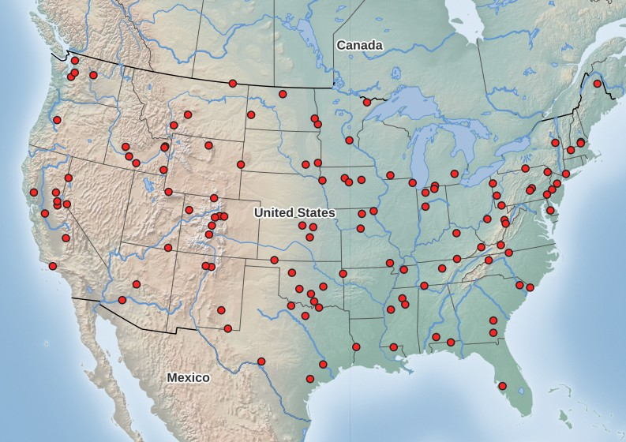
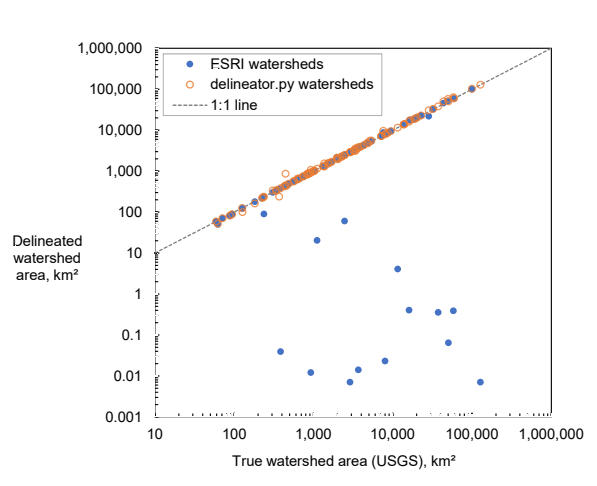
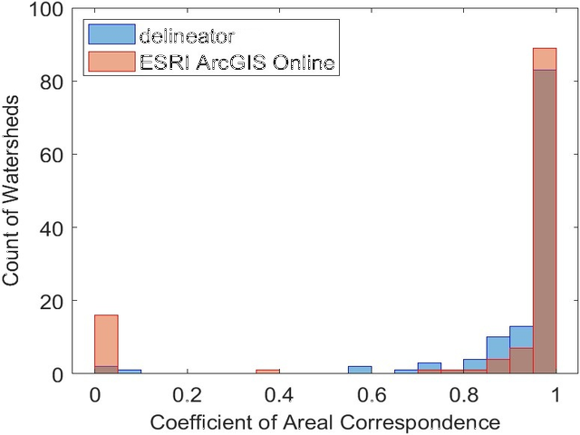

# Experiment 2 - Checking the accuracy of delineator

This experiment was to determine whether the watersheds created with 
`delineator` are reasonable and accurate, i.e. whether the boundaries are true, 
by comparing them to US Geological Survey watershed boundaries for river gaging
stations in the continental United States. 

In one sense, this experiment is a test of the MERIT-Hydro dataset, which has a
relatively coarse resolution (~90 m) compared to publicly-available US datasets
like the 10 m resolution National Elevation Dataset.

## Sampling

First, I created a set of outlet points by sampling 120 gages from the catalog
of USGS gaging stations. (Why n = 120? First I sampled 100 points from the 
Federal Priorities Streamgage dataset, reasoning that gages that are currently
operating are more likely to have updated watershed boundaries, compared to 
historical gages. I later realized there were no west coast stations in 
CA, ID, OR, NV, and WA. So I drew 20 more samples so the western region would be included.) 

I did stratified sampling, to ensure that I got samples from across
the range of watershed sizes.

First step was to get a list of all of the active gages. I obtained this 
from: https://water.usgs.gov/networks/fps/

This is a list of 4,356 "federal priority stream gages"
and it has a field saying whether the gage is active or not. 
I downloaded this table, and saved it as: `FPS_States_and_Territories.xlsx`.

To delineate the watersheds for these gages, I needed their latitude
and longitude coordinates. As these were not in the FPS table, I got
them from a different data source and did a table join to look up
the coordinates for my sample gages. 

The gage metadata came from the page:
https://water.usgs.gov/GIS/metadata/usgswrd/XML/streamgages.xml#stdorder

I downloaded the file: https://water.usgs.gov/GIS/dsdl/USGS_Streamgages-NHD_Locations_GEODB.zip

This is an ESRI Geodatabase file, `.mdb` I saved the database table as a CSV, 
which stripped the geometry data. 
We don't need the geomerty because the attribute table contains the lat, lng coordinates of the point, 
which is sufficient. I saved a table of my 120 samples as: `samples_tbl.csv`

The manuscript map was created with QGIS in `expt2_sample_locations_MAP.qgz`.

## USGS Watersheds

To get the "official" watersheds for the gages, according to the USGS, I used
the  Hydro Network-Linked Data Index (NLDI) API with the script 
`get_gage_wsheds_nldi.py`. 

## ESRI watersheds

Then, I created an account with ESRI to use ArcGISOnline. Using their online
map interface, I uploaded a .csv of my sample gages, which includes fields for latitude
and longitude. I followed the instructions for using the "Create Watersheds" 
tool:

https://doc.arcgis.com/en/arcgis-online/analyze/create-watersheds-mv.htm

I downloaded the results as a shapefile. My initial efforts at performing
geoprocessing operations with these data (to find the intersection and union with 
USGS watersheds) in QGIS failed. This was overcome by running the QGIS's 
"Fix Geometries" tool on the shapefiles. 

## Comparison Metric

Initially, I used QGIS to calculate the area of each watershed polygon, in square 
kilometers. These results are in `AREA Comparison.xlsx`. 

However, I realized that comparing areas is a poor indicator of 
similarity for two watersheds. Two watersheds may have similar areas but
be totally nonoverlapping. After some research on this, I discovered that there
are several methods for comparing polygons, which go by a variety of names: 
Coefficient of Areal Correspondance (older geography texts), Jaccard Index 
(common in French-language publications), and the Intersection over Union 
(popular in machine learning). I initially calculated this via a manual process
in QGIS and Excel. When I prepared the manuscript, I revisited this step, 
to make the workflow more repeatable, I calculated the CAC in Python. 
This Python function for this is in `compare_watersheds.py`

## Results

I analyzed the results by calculating the area for the watersheds and the 
CAC to compare watersheds created by delineator and ESRI. 

I used the following files to analyze the results:

- `expt2_MAP.qgz` - I used this map to visualize the results of this experiment, 
by mapping the watershed boundaries. The Python script `qgis_map_each_watershed.py`
zooms to every watershed and then outputs the map as a JPG image. Scrolling
through the maps allows one to quickly review the results. 

- `AREA Comparison.xlsx` - Scatterplot of the delineated watershed areas, 
comparing delineator with ESRI. 

- `make_histogram.m` - Makes a histogram of the CACs, for the manuscript. 

## Conclusion

The results were slightly surprising to me. I quickly realized that ESRI's
methods must be based on USGS data. Often 
the results are a near-perfect match with the USGS' official 
watershed boundaries. 

However, sometimes, the ESRI results were quite poor. I realized
that this was usually because the pour point had been snapped
to the wrong stream. So this problem is probably fixable, by 
adjusting the outlet coordinates and re-running the delineation.  

So this created a bit of a quandary. Do I iterate, perform what
I call "human in the loop" delineation for each point? This can be
done by nudging the outlet location slightly and trying again. We could 
also try adjusting the **search distance** , defined by ESRI as 
"the maximum allowed distance to move the location of an input pour point."
 Or do I just accept the initial results? I decided to do the latter. 
 Partly because I did not want to spend days on this little experiment. 
 But also because the experiment was designed to test
the software's accuracy, and the pour point snapping algorithm is a part
of the overall delineation process. 

Where ESRI's pour point snapping was good, their results were usually very 
good, with CAC > 0.95 in many cases. This is not unexpected, as delineator's
input data has coarser resolution and therefore lower accuracy. While MERIT-Hydro 
has global coverage, its resolution (90 m) is much less than the USGS National Elevation 
 Dataset (10 m).
 
