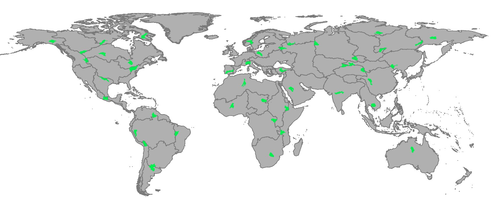

# Benchmarking Experiment 4: Testing the effect of raster file size on watershed delineation speed

In this experiment, we test the effect of the input file size on delineation 
speed, while holding the watershed roughly constant.

For this, we need to find arbitrary outlet points with a given upstream area. 

I chose an upstream accumulation of 10 million pixels. This is equivalent to 
around 86,000 km² near the equator, although the area varies with latitude.
So we are not holding the area constant, but rather the number of upstream grid cells. 

To find the outlet location that corresponds to a 10 million pixel watersheds, 
I used the Matlab script `find_outlets_with_10M_upstream_pixels.m`. I used this 
to search for an outlet in each of the 61 major drainage basins, or megabasins. 

The scripts open the flow accumulation georasters as a matrix, and searches for
 a pixel with the value 10e6, and determines its lat, lng coordinates. 
However, there is not always a cell with an accumulation of exactly 10M upstream cells, 
so the script lookes for a cell that exceeds 10M by as little as possible. In some 
smaller basins, there are no watersheds this large, so they are  excluded from this experiment. 
We ended up finding outlets in 47 of the 61 basins. 

I then delineated the watersheds and timed the delineation using the Python 
scripts in this folder. The results were compiled and analyzed in the 
Excel workbook `Benchmarking Results.xlsx`. 

The resulting watersheds are shown here:

