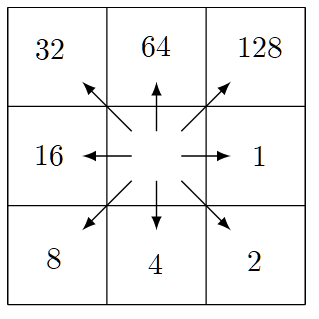

# Preparing MERIT-Hydro for TauDEM

Scripts in this folder are for preparing **MERIT-Hydro** raster data for use with  **TauDEM**.

MERIT-Hydro encodes D8 flow direction as powers of two (the ESRI/ArcGIS
convention), whereas TauDEM uses the integers 1–8. The grids therefore have to
be re-coded before any TauDEM function will interpret them correctly. 

After re-coding, flow accumulation and a stream raster are computed with TauDEM, 
and the outputs are compressed for storage.

Data are organized by MERIT level-2 (Pfafstetter) basin, each with a two-digit
code (e.g. `33`, `74`); the leading digit indicates the broad continental
region.


## Files

### `qgis_reclassify_merit_fdir_for_TauDEM.py`

Run from the **Python console inside QGIS**. For each basin it:

1. Reclassifies `flow_dir_basins/flowdir##.tif` from MERIT-Hydro codes to
   TauDEM codes with `native:reclassifybytable` (Int16 output, exact-match
   ranges).
2. Compresses the result with `gdal:translate` (`COMPRESS=DEFLATE`) into
   `fdir_taudem/flowdir##.tif`, then deletes the temporary file.

The two-step approach exists because `reclassifybytable` ignores compression
options — its raw output is uncompressed and can exceed 3 GB per basin, so a
GDAL pass is used to shrink it. The working directory is hard-coded to
`C:/Data/GIS/MERITHydro`.

### `make_stream_rasters_4_taudem.bat`

Runs TauDEM's `Threshold` tool on each basin's accumulation grid:

```bat
mpiexec -n 4 Threshold -ssa accum##.tif -src streams##.tif -thresh 3000.0
```

Cells whose contributing area is ≥ 3000 cells become stream cells (`1`); all
others become `0`. At MERIT-Hydro's ~90 m resolution, 3000 cells is roughly
24 km² near the equator (smaller at higher latitudes, since `AreaD8` counts
cells rather than ground area). Output: `streams##.tif`.

### `stream_rasters_compress.bat`

Copies each `streams##.tif` into the sibling `../streams/` folder with DEFLATE
compression via `gdal_translate`. TauDEM writes uncompressed GeoTIFFs, so this
is purely for saving disk space.


## Flow-direction encoding conversion

This is the core of the re-coding. MERIT-Hydro uses powers of two clockwise from
east. This is sometimes called the ESRI standard, although it appears that the 
original source is a paper by Jenson and Domingue (1988). 

**MERIT Flow Direction Encoding**



**TauDEM Flow Direction Encoding:**


| Direction                   | MERIT-Hydro | TauDEM     |
|-----------------------------|------------:|-----------:|
| East                        | 1           | 1          |
| Southeast                   | 2           | 8          |
| South                       | 4           | 7          |
| Southwest                   | 8           | 6          |
| West                        | 16          | 5          |
| Northwest                   | 32          | 4          |
| North                       | 64          | 3          |
| Northeast                   | 128         | 2          |
| River mouth (outlet to sea) | 0           | 0          |
| Ocean / undefined           | 247         | -32768     |
| Inland sink                 | -1          | -1         |

Notes on the special values:

- **`247` → NoData.** MERIT-Hydro stores "undefined (ocean)" as `−9` in a
  *signed* byte. When the basin GeoTIFFs are read as an *unsigned* byte, `−9`
  appears as `247` (256 − 9), which is the value the table targets.


## Requirements

- **QGIS** (with the Processing framework / GDAL provider) — for the reclassify
  script.
- **TauDEM** with an MPI runtime (`mpiexec` on the PATH) — for `Threshold` (and
  `AreaD8`).
- **GDAL** command-line tools (`gdal_translate` on the PATH) — for compression.

The batch files are written for Windows.


## Expected directory layout

Relative to `C:/Data/GIS/MERITHydro`:

```
MERITHydro/
├── flow_dir_basins/      # input: MERIT-Hydro flowdir##.tif (powers of 2)
├── fdir_taudem/          # output of step 1: TauDEM-coded flow direction
│   ├── flowdir##.tif
│   └── temp.tif          # transient, deleted by the script
├── <work dir>/           # accum##.tif and streams##.tif (steps 2–3)
└── streams/              # output of step 4: compressed stream rasters
```

The batch files assume the current working directory holds the `accum##.tif`
and `streams##.tif` grids and write the compressed streams to `../streams/`.
